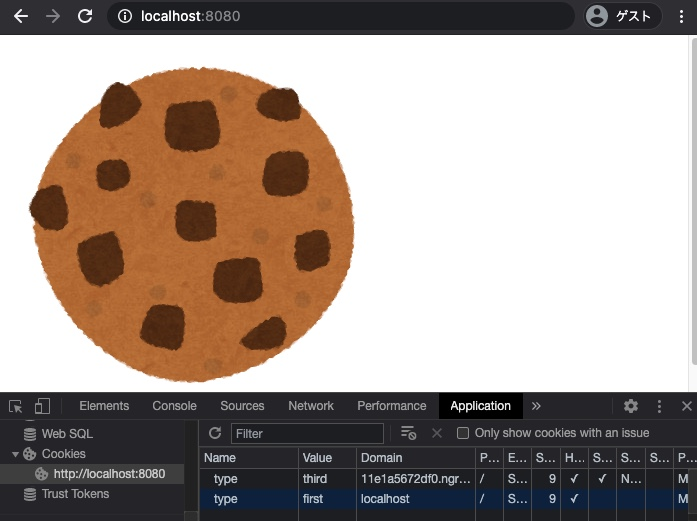

## 課題１（質問）
### サードパーティクッキーとファーストパーティクッキーの違い
- サードパーティクッキー
  - 広告などの用途で、外部サービスから読み込めるクッキーを埋め込み、サイトを跨いだ行動追跡を可能にするクッキー
- ファーストパーティクッキー
  - ブラウザでアクセスしたそのサービス内でのみ有効なクッキー

### サードパーティクッキーを用いた広告配信ネットワークの仕組み
例えばあるユーザがサイト内のバナー広告にアクセスした場合、別ドメインのアドサーバーがサードパーティクッキーを発行してブラウザに送信する。同様に様々なサイトでサードパーティクッキーが発行されることで、より詳細なユーザ像がわかるようになる。

### サードパーティクッキー生成の仕組み
- imgタグで参照された画像を返すときにSet-Cookieヘッダを含める方法
- iframeタグからフォームを作成して送信する方法
- JSで`postMessage()`を使って他のサイトを開いているウインドウと情報をやり取りする方法

### サードパーティクッキーのブラウザによる違い
- Safari
  - クッキーに関する設定のデフォルトが「訪問したWebサイトを許可」になっており、アクセスしたサイト以外のドメインからのクッキーは全て拒絶する
- Firefox
  - サードパーティークッキーはデフォルトでブロックする
- Chrome
  - サードパーティークッキーをデフォルトでブロックする予定があったが、新型コロナの世界的な流行の影響により一時的に保留となっている

### ドメインは同一で、ポートが異なるクッキー
ポートが異なると同一オリジンではないので、サードパーティクッキーになる

## 課題２（実装）
### 動作確認の手順
- パッケージをインストールする。
```shell
$ npm install
```
- ローカルサーバを立ち上げる。
```shell
$ node index.js
```

- ngrokでローカルの8081番ポートを公開する。
```shell
$ ngrok http 8081
```

- ngrokで発行されたドメインを`public/index.html`のimgタグに設定する。

- `localhost:8080`にアクセス

### 動作結果
ページの読み込みと同時に、ファーストパーティクッキーとサードパーティクッキーが設定される。

