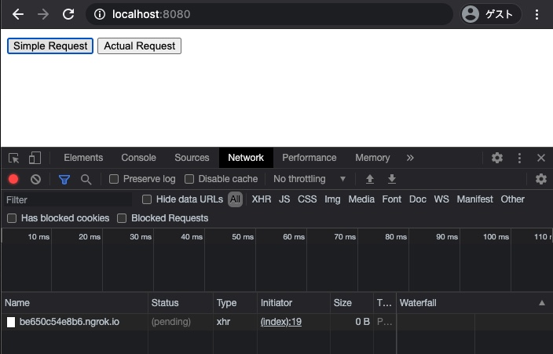
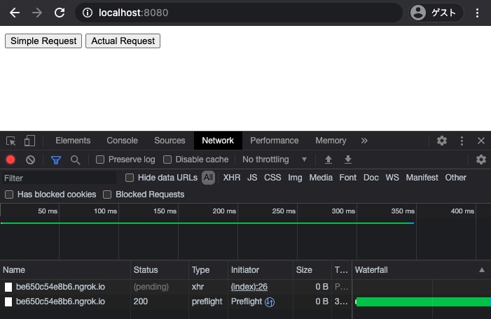

## 課題1（質問）
### CORSの仕組み
ブラウザからサーバへのリクエストが「シンプルなリクエスト」ではない場合、ブラウザはpreflight requestを発行する。
preflight requestに対してサーバは、通信を許可するオリジン名をaccess-control-allow-originヘッダに設定してブラウザにレスポンスを返す。
ブラウザは、そのオリジン名の中に含まれていればリクエストを実行し、含まれていなければエラーを返す。
このように、ブラウザからサーバにアクセスする直前までの権限確認の仕組みのことをCORSという。

### `Access-Control-Allow-Origin: *`が問題となるケース
Cookieなどの資格情報を含むリクエストがエラーになり、ステートフルな通信ができない。
[参考: MDN Web Docs](https://developer.mozilla.org/en-US/docs/Web/HTTP/CORS/Errors/CORSNotSupportingCredentials)

### シンプルなリクエストの条件
以下条件を全て満たすこと。
- HTTPのリクエストメソッドがシンプルメソッド（GET, HEAD, POSTのいずれか）であること
- ヘッダがシンプルヘッダのみ（Accept、Accept-Language、Content-Laungauge、Content-Type以外を含まない）
- Content-Typeを含む場合、その値がapplication/x-www-form-urlencoded、multipart/formdata、text-plainのいずれかであること

### Access-Control-Allow-Originヘッダーに、リクエスト送信元のオリジンが含まれない場合のブラウザの挙動
ブラウザーコンソールに "Cross-Origin Request Blocked: The Same Origin Policy disallows reading the remote resource at $somesite" のようなエラーが表示される。
[参考: MDN Web Docs](https://developer.mozilla.org/ja/docs/Web/HTTP/CORS/Errors)

### XMLHttpRequestでクッキー情報を含める方法
Access-Control-Allow-Credentialsヘッダーに、`xhr.withCredentials = true;`を設定する。

## 課題2（クイズ）
CORSリクエストを許可するために最低限設定が必要なヘッダは？ `Access-Control-...`の何かでお答えください。

## 課題3（実装）
### 動作確認の手順
- パッケージをインストールする。
```shell
$ npm install
```
- ローカルサーバを立ち上げる。
```shell
$ node index.js
```

- ngrokでローカルの8081番ポートを公開する。
```shell
$ ngrok http 8081
```

- ngrokで発行されたドメインを`views/request.ejs`のURLに設定する。

- `localhost:8080`にアクセス

### 動作結果
#### `Simple request`のとき
Simple Requestボタンを押しても、preflightが行われない。


#### `Simple request`に該当しないとき
Actual Requestボタンを押すと、preflightが行われる。


## 課題4（成果物に関する質問）
### curlでSimple requestに該当しないPOSTリクエストを送信
```shell
$ curl -H 'Content-Type: application/json' -X POST https://be650c54e8b6.ngrok.io
```

### curlからのリクエストで、CORS制約は適用されるか
適用されない。

### その理由
CORSはブラウザの仕組みであり、curlではpreflight requestが発行されないため。
