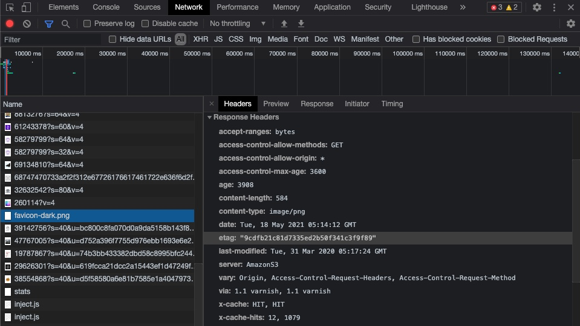
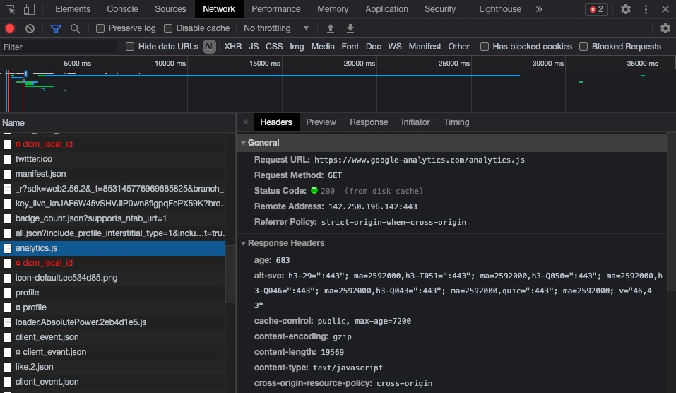
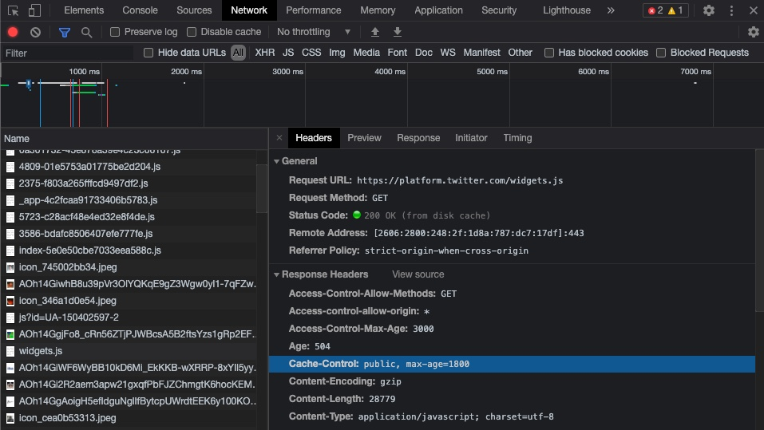

## 課題1（質問）
### なぜキャッシュが必要なのか
サーバは、受け付けるリクエストが増えれば増えるほど負荷が大きくなり、処理速度が落ちる。
ブラウザは、取得したサーバからのレスポンスをキャッシュとして保存しておくことで、同じリクエストをしたときのサーバの負荷を軽減することができるため。

### キャッシュの種類
- ブラウザキャッシュ
  - ブラウザは一度読み込んだリソースをキャッシュし、次回以降のアクセスではキャッシュからリソースを読み込むことで、ページ表示の時間を削減できる。
- Dockerレイヤーキャッシュ
  - Dockerイメージのビルド時、キャッシュを使うことで既に実行済みのインストールコマンド等は省略し、ビルドの時間を削減できる。

### HTTP通信における、ブラウザがキャッシュを制御するために存在するヘッダー
- Expiresヘッダ
  - 一度リソースの取得を行うと、期限が切れるまで自動的にブラウザ内部にキャッシュされる
  - 一度有効になるとサーバにHTTPリスエストをしなくなる
  - クライアントとサーバ間で時間設定が異なると、うまく設定できないという欠点がある
- Cache-Controlヘッダ
  - Expireヘッダ同様、一度有効になるとサーバにHTTPリスエストをしなくなる
  - max-ageパラメータでキャッシュの期限を秒数で指定できる
- Last-Modifiedヘッダ
  - そのURLのリソースが最後に変更されたのがいつなのかを設定する
  - 条件付きGETリクエストによりHTTPレスポンスを小さくすることができる
- ETagヘッダ
  - HTTPリクエストで取得するURLのリソースのバージョンを指定する
  - 更新されていたら新しいリソースをサーバから取得、更新されていなければブラウザキャッシュを使い回す

### ブラウザのキャッシュサイズの容量上限
容量上限を超えるとorigin evictionと呼ばれる処理を実行して、ストレージの総量が再び上限を下回るまで、生成元全体に相当するデータを削除する。

ブラウザのストレージの最大容量は動的であり、保存先ディスクのサイズに応じて変わる。容量上限は、グローバルリミットと呼ばれる保存先ディスクの空き容量の50%である。
[参考: MDN Web Docs](https://developer.mozilla.org/ja/docs/Web/API/IndexedDB_API/Browser_storage_limits_and_eviction_criteria)

### 動的なサイトをキャッシュするなら、expiresは使わない方がいい理由
expiresで指定した期限を迎えるまでは、サーバに対して変更があったかどうかの問い合わせをしなくなり、新しいコンテンツを見ることができないため。
`Cache-Control: "no-cache"`によりキャッシュしないようにすると良い。

### ブラウザのキャッシュがWEBサービスに用いられている実例
#### GitHub
faviconにEtagヘッダが設定されている(disk cache)


#### Twitter
Google Analyticsのスクリプトが`max-age=7200`で設定されている(disk cache)


#### Zenn
TwitterのWidgetのスクリプトが`max-age=1800`で設定されている(disk cache)


キャッシュが有効なCSS, JS, 画像などはそのHTTPヘッダに従って、ブラウザにキャッシュされる。

## 課題２（実装）
### 動作確認の手順
- ローカルサーバを立ち上げる。
```shell
$ node index.js
```

- エンドポイント
  - [キャッシュ有効](http://localhost:8080/image.jpg)
  - [キャッシュ無効](http://localhost:8081/image.jpg)

## 課題３（成果物に関する質問）
>どんなサービスの？

ニュースサイトなどの速報性が高いサービス

>どんなページで？

アクセスが多いトップページ

>どんなファイルを？

更新の頻度が高いhtmlファイル

## 課題４（クイズ）
Chromeの開発者ツールで、キャッシュを無効にする方法は？
（開発中、CSSやJSを頻繁に更新する場合、設定しておくと便利です）
