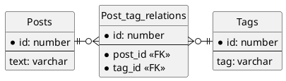

## 課題１
- どんな問題が生じるか？
```
- カンマ区切りの列を条件に検索する際、パターンマッチを使わなくてはならない。
  - パターンマッチの構文はRDBMSによって異なる。
  - インデックスの恩恵を受けることができない。
- カンマ区切りの列を結合条件にして、テーブル結合することに手間がかかる。
  - クエリが複雑になる。
- タグに無関係な文字列（例えば"banana"等）を格納することができてしまう。
  - アプリケーション側でバリデーションする等の必要がある。
```

## 課題2
投稿とタグは多対多の関係にあるので、交差（中間）テーブルの`Post_tag_relations`を作成すると良い。

### ER図

