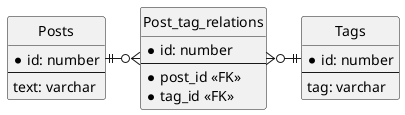

## 課題１
### どんな問題が生じるか？
- タグの値を検索する場合、tag1, tag2, tag3の3列全てを対象としなければならない。
- タグの値を追加する場合、tag1, tag2, tag3のどれが空いている（NULL）かを事前に確認してからUPDATA文で値をセットする必要がある。
  - 事前の確認を怠ると、既にあるタグの値を上書きする恐れがある。
- タグの値を削除する場合、tag1, tag2, tag3のどれに削除したい値があるかを事前に確認してからUPDATA文でNULLをセットする必要がある。
  - 事前の確認を怠ると、意図しないタグの値をNULLに更新する恐れがある。
- 複数のタグのカラムに同じ値が格納される恐れがあるため、一意性が保証されない。
- タグの種類が増えるたび、スキーマの変更が必要になる。
  - スキーマの変更に伴い、アプリケーションのSQL文を編集する必要がある。

## 課題２
### 解決策
投稿とタグは多対多の関係にあるので、交差（中間）テーブルの`Post_tag_relations`を作成すると良い。
### ER図

