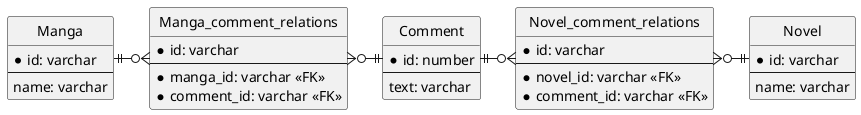
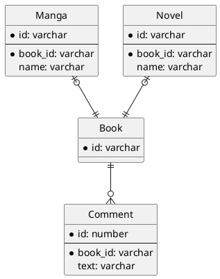
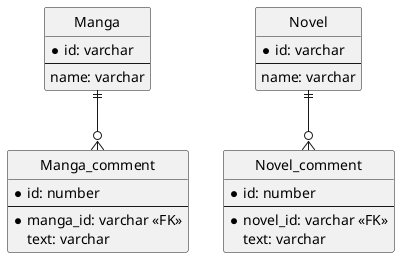

## 課題１
### どんな問題が生じるか？
#### 参照整合性が保たれない
Commentテーブルの`belongs_to_id`には外部キー制約が設定されていないため、Manga, Novelテーブルに存在しないidを格納できてしまう。
そのため、DBの制約で参照整合性を保証することができず、関連付けの管理がアプリケーション側に依存することになる。

## 課題２
### 解決策1
#### Commentテーブルと各親テーブルの中間テーブルを作成する
Manga, Novelテーブルそれぞれに対応した中間テーブルを作成し、各中間テーブルでCommnetテーブルへの外部キー制約に加えて、Manga, Novelテーブルにも同じく外部キー制約を設定する。
外部キー制約により参照整合性が保証される。

#### ER図

### 解決策2
#### Manga, Novel, Commentの共通の親テーブルを作成する
全ての親テーブルを継承するBookテーブル（基底テーブル）を使うことで、外部キーにより参照整合性を保証できる。

#### ER図

### 解決策3
#### 各親テーブルに対して1つのCommentテーブルを作成する
Commnetテーブルを分割して、Mangaテーブルに紐付くMangaCommentテーブル、Novelテーブルに紐付くNovelCommentテーブルをそれぞれ作成する。
Manga, Novelテーブルにそれぞれ外部キー制約を設定することで、参照整合性が保証される。

#### ER図

