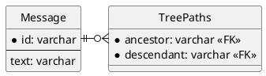

## 課題１
### どんな問題が生じるか？
この設計は、`隣接リストモデル`と呼ばれる。
- ツリー型のデータ構造では、階層の深さに制限がない場合が多いため、深さに関わらず子孫（子、子の子、子の子の子、...）を取得するクエリの実行が難しい。
  - MySQLの8系より前のバージョンでは、CTE（共通テーブル式）を用いた再帰クエリが実装されていなかったため、この設計はアンチパターンとして認識されていた。
- ノードの削除に注意が必要である。
  - ノードは親を持たない最上位の根（ルート）ノード、子を持たない最下部の葉（リーフ）ノード、中間の非葉ノードに分類される。
    - 非葉ノードを削除する場合は、その全ての子孫を特定するために、複数回クエリを実行し、次に、外部キーの整合性制約を満たすために、最下層から順番に子孫を削除する必要がある。
      - この操作は、外部キー定義時にON DELETE CASCADE修飾子を付けることによって自動化できるが、自動化が有効なのはしそ運を削除する場合のみで、ノードの昇格や移動は自動化できない。

## 課題2
### 解決策
閉包テーブル（以下ER図の`TreePaths`）を使う。


TreePathsには先祖/子孫関係を共有するノードの組み合わせを格納する。
```
1
├── 2
│   └── 3
└── 4
    ├── 5
    └── 6
        └── 7
```
上記のようなツリー構造のデータがある時（数字はMessageのid）、次のように書くことでMessage`4`の子孫を取得するできる。
```sql
SELECT m.id
FROM Message AS m
  JOIN TreePaths AS t ON m.id = t.descendant
WHERE t.ancestor = 4;

+----+
| id |
+----+
|  4 |
|  5 |
|  6 |
|  7 |
+----+
```
また、次のように書くとMessage`6`の先祖を取得できる。
```sql
SELECT m.id
FROM Message AS m
  JOIN TreePaths AS t ON m.id = t.ancestor
WHERE t.descendant = 6;

+----+
| id |
+----+
|  1 |
|  4 |
|  6 |
+----+
```

Messageの削除では、

ただし、階層が深くなると多くのレコードが別個のテーブルに必要となり、ストレージを圧迫するというデメリットがある。