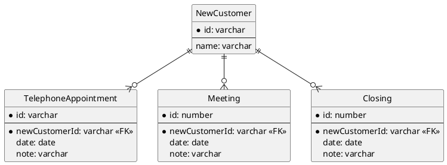

## 課題１
### どんな問題が生じるか？
```
TABLE NewCustomer {
  id: varchar
  telephone: boolean -- 電話をかけたらTRUEになる
  metOnce: boolean -- アポで面談したらTRUEになる
  metAt: date -- 面談をした日付が入る
  closed: boolean -- 成約した
  closedAt: boolean -- 成約した日付が入る
}
```

#### データ不整合が生じる恐れがある
`metOnce`と`metAt`、`closed`と`closedAt`の間でデータの不整合が生じる恐れがある。
本来、`metOnce`と`metAt`の組み合わせには面談未実施と面談済みの以下2通りしかない。

| metOnce    | metAt       |
|:-----------|:------------|
| true       | 面談した日付  |
| false      | NULL        |

しかし、更新系SQLのトランザクションの不備やアプリケーション側のバグにより以下の組み合わせが生まれる恐れがある。

| metOnce    | metAt       |
|:-----------|:------------|
| true       | NULL        |
| false      | 面談した日付  |

これでは、面談が実施済みなのか否かの判断ができない。
そもそも、`metAt`がNULLなら面談未実施、`metAt`に面談した日付が入っていれば面談済みであることを判断できるので、boolean型の`metOnce`に存在価値はないと言える。

`closed`と`closedAt`の関係にいても、同様である。

#### 1つの顧客に対して、1つの面談と成約の状況しか保持することができない
現実世界では１つの顧客に対して、複数回面談をしたり、一度成約に至った契約が何らかの理由により破棄される可能性がある。しかし、この設計では1つの顧客を1レコードで保持するため、それらの履歴を保持することができない。

#### 電話をかけた結果がわからない
`telephone`には`電話をかけたか否か`という情報のみが記録され、電話をかけた時の結果（電話に出なかった、電話に出たが面談は断られた、電話に出て面談の約束ができた等）がわからない。
そのため、たまたま電話に出なかっただけなのに値がtrueだったので、その顧客にはもう電話しないなど、商機を逸する恐れ等が考えられる。

## 課題２
### 解決策
顧客と各イベント（電話、面談、成約）が1対多で紐づくようにテーブルを分離する。
そうすることで、各イベントの履歴を保持することができる。また、各イベントの日時に加えてその結果を記録するカラムを追加することで、顧客の担当者が変わっても引き継ぎが容易になる。

### ER図

