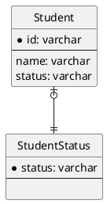

## 課題１
### どんな問題が生じるか？
```
TABLE Student {
  id: varchar
  name: varchar
  status: varchar CHECK(status IN ("studying", "graduated", "suspended"))
}
```

#### statusの取りうる値一覧の取得に手間がかかる
以下のシンプルなクエリでstatusの取りうる値一覧を取得するとき、既存の生徒が全て`studying`のステータスであれば、'studying'しか返ってこない。
```sql
SELECT DISTINCT status
FROM Student;
```

statusの完全な一覧を取得するには、以下のようにメタデータ定義を取得する必要がある。
```sql
SELECT column_type
FROM information_schema.columns
WHERE table_name = 'student'
AND column_name = 'status';
```
ただし、このSQLで得られるのは`enum('studying','graduated','suspended')`という値が格納されたLONGTEXT型の列であり、アプリケーション側で扱うにはこの文字列を解析する手間が生じる。

なお、CHECK制約が実装されたMySQL8.0.16以降では以下のSQLでCHECK制約の確認ができる。
```
mysql> SHOW CREATE TABLE Student;
+---------+------------------------------------------------------------------------------------------------------+
| Table   | Create Table                                                                                         |
+---------+------------------------------------------------------------------------------------------------------+
| Student | CREATE TABLE `Student` (
  `id` int NOT NULL,
  `name` varchar(50) DEFAULT NULL,
  `status` varchar(10) DEFAULT NULL,
  PRIMARY KEY (`id`),
  CONSTRAINT `statuscheck` CHECK ((`status` in (_utf8mb4'studying',_utf8mb4'graduated',_utf8mb4'suspended')))
) ENGINE=InnoDB DEFAULT CHARSET=utf8mb4 COLLATE=utf8mb4_0900_ai_ci |
+---------+------------------------------------------------------------------------------------------------------+
1 row in set (0.00 sec)
```

#### 新しいstatusの追加に注意が必要となる

statusの制約に「dropouted」（退学）を追加したい場合、以下のALTER文を使う。

```sql
ALTER TABLE Student
MODIFY COLUMN status
ENUM('studying', 'graduated', 'suspended', 'dropouted');
```

MySQL5.5以前では、ALTER文の実行中はテーブルがロックされるため参照も更新もできなくなる。テーブルのレコード数が多いほどロック時間も長くなるため、サービス運用に支障がないか事前に検討した方が良い。
なお、MySQL5.6以降ではオンラインDDLが実装されているため、上記問題は起こりづらい。

#### 他のRBDMSへの移植が限定される
CHECK制約をサポートしていないRDBMSが

## 課題2
### 解決策
参照テーブル`StudentStatus`に許可するstatus値を格納し、Student.statusに外部キー制約を宣言する。
```sql
CREATE TABLE StudentStatus (
  status VARCHAR(20) PRIMARY KEY
);

INSERT INTO StudentStatus (status) VALUES ('studying'), ('graduated'), ('suspended');

CREATE TABLE Student (
  -- idとnameは省略
  status VARCHAR(20),
  FOREIGN KEY (status) REFERENCES StudentStatus(status)
  ON UPDATE CASCADE
);
```

このようにすることで、Studentテーブルにレコードの作成や更新を行うときは、StudentStatusに存在するstatus値を使わなければならない制約を作ることができる。

#### statusの取りうる値一覧の取得
シンプルに取得することができる。
```sql
SELECT status
FROM StudentStatus;
```

#### 新しいstatusの追加
ALTER文ではなく、INSERT文で制約を追加できる。
```sql
INSERT INTO StudentStatus (status) VALUES ('dropouted');
```


 

#### ER図

