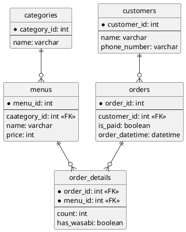

## 課題１
### DBスキーマ設計
```sql
CREATE TABLE IF NOT EXISTS categories (
    category_id INT PRIMARY KEY,
    name VARCHAR(255) NOT NULL # 盛り込み, にぎり, お好みすし 等
);

CREATE TABLE IF NOT EXISTS menus (
    menu_id INT PRIMARY KEY,
    category_id INT,
    name VARCHAR(255) NOT NULL, # はな, 玉子 等
    price INT NOT NULL, # 8650, 100 等
    CONSTRAINT
        FOREIGN KEY (category_id)
        REFERENCES categories(category_id)
);

CREATE TABLE IF NOT EXISTS customers (
    customer_id INT PRIMARY KEY,
    name VARCHAR(255) NOT NULL, # 山田太郎, 田中 花子 等
    phone_number VARCHAR(255) # 08012345678, 03-1234-5678 等
);

CREATE TABLE IF NOT EXISTS orders (
    order_id INT PRIMARY KEY,
    customer_id INT,
    is_paid TINYINT NOT NULL,
    note VARCHAR(255), # さびありとさびぬきで容器を分けてください 等
    order_datetime DATETIME NOT NULL,
    CONSTRAINT 
        FOREIGN KEY (customer_id)
        REFERENCES customers(customer_id)
);

CREATE TABLE IF NOT EXISTS order_details (
    order_id INT,
    menu_id INT,
    count INT NOT NULL,
    has_wasabi TINYINT NOT NULL,
    PRIMARY KEY (order_id, menu_id),
    CONSTRAINT
        FOREIGN KEY (order_id)
        REFERENCES orders(order_id),
    CONSTRAINT 
        FOREIGN KEY (menu_id)
        REFERENCES menus(menu_id)
);
```

### UML図


## 課題２
しゃりの大きさ、セット商品か否かの情報を持つカラムを追加する。
```sql
ALTER TABLE order_details
    ADD shari_size INT NOT NULL;

# 課題1の設計のcategoriesのnameが"お好みすし"とそれ以外で分けて計算することも可能
ALTER TABLE categories
    ADD is_set TINYINT NOT NULL;
```

## 課題3
追加仕様: 店舗が増えて、各店舗限定メニューを取り扱うことになった。
