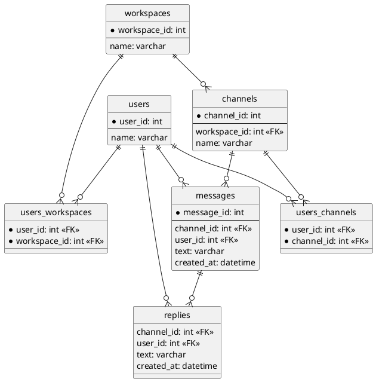

## 課題１
### DBスキーマ設計
```sql
CREATE TABLE IF NOT EXISTS users (
    user_id INT PRIMARY KEY,
    name VARCHAR(255) NOT NULL
);

CREATE TABLE IF NOT EXISTS workspaces (
    workspace_id INT PRIMARY KEY,
    name VARCHAR(255) NOT NULL
);

CREATE TABLE IF NOT EXISTS channels (
    channel_id INT PRIMARY KEY,
    workspace_id INT,
    name VARCHAR(255) NOT NULL,
    CONSTRAINT
        FOREIGN KEY (workspace_id)
        REFERENCES workspaces(workspace_id)
);

CREATE TABLE IF NOT EXISTS messages (
    message_id INT PRIMARY KEY,
    channel_id INT,
    user_id INT,
    text VARCHAR(255) NOT NULL,
    created_at DATETIME NOT NULL, # 表示順に仕様
    CONSTRAINT
        FOREIGN KEY (channel_id)
        REFERENCES channels(channel_id),
    CONSTRAINT
        FOREIGN KEY (user_id)
        REFERENCES users(user_id)
);

CREATE TABLE IF NOT EXISTS replies (
    message_id INT,
    user_id INT,
    text VARCHAR(255) NOT NULL,
    created_at DATETIME NOT NULL, # 表示順に仕様
    CONSTRAINT
        FOREIGN KEY (message_id)
        REFERENCES messages(message_id),
    CONSTRAINT
        FOREIGN KEY (user_id)
        REFERENCES users(user_id)
);

CREATE TABLE IF NOT EXISTS users_workspaces (
    user_id INT,
    workspace_id INT,
    PRIMARY KEY (user_id, workspace_id),
    CONSTRAINT
        FOREIGN KEY (user_id)
        REFERENCES users(user_id),
    CONSTRAINT 
        FOREIGN KEY (workspace_id)
        REFERENCES workspaces(workspace_id)
);

CREATE TABLE IF NOT EXISTS users_channels (
    user_id INT,
    channel_id INT,
    PRIMARY KEY (user_id, channel_id),
    CONSTRAINT
        FOREIGN KEY (user_id)
        REFERENCES users(user_id),
    CONSTRAINT 
        FOREIGN KEY (channel_id)
        REFERENCES channels(channel_id)
);
```

### UML図


## その他メモ
- チャンネルの種別（public, private, DMなど）
  - channelsテーブルのchannel_typeで表現
- リアクション（スタンプ）
  - reactionsテーブルを作成
    - users - reactions が1対多の関係
    - messages - reactions が1対多の関係
    - replies - reactions が1対多の関係
