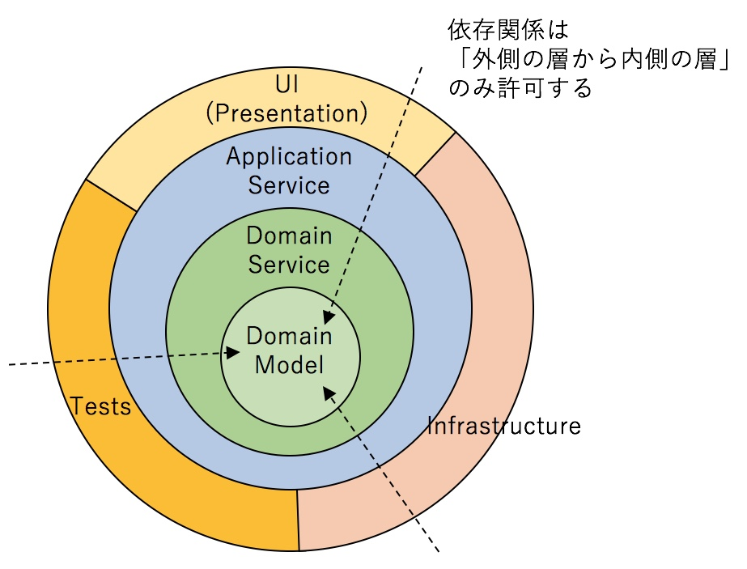
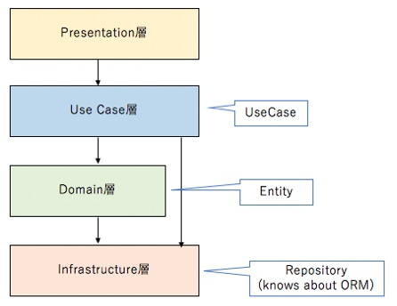
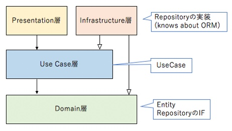
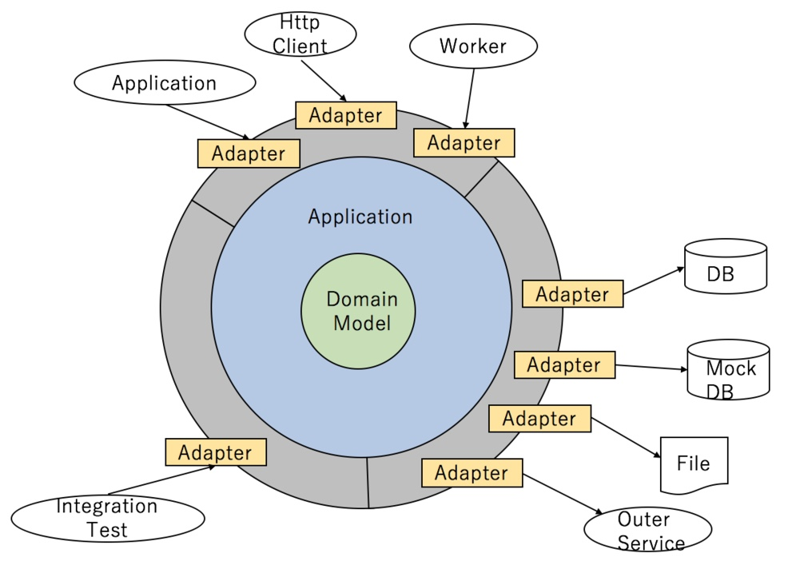

# 課題1
## オニオンアーキテクチャの図解
下図のように、依存関係は「外側の層から内側の層」のみ許可する。



### ドメイン層（ドメインモデル層 + ドメインサービス層）
ドメイン知識（ルール/制約）を表現する。この層を独立させ、他の層への依存を持たせないようにする。

主なクラスは、ドメインオブジェクト（エンティティ、値オブジェクト、ドメインイベント）と、それを利用するクラス（リポジトリのインターフェース、ドメインサービス、ファクトリー）がある。

### ユースケース層（アプリケーション層）
ドメイン層が公開している操作を組み合わせて、ユースケースを実現させる。特定のクライアントには依存しない実装にする。

主なクラスは、ユースケースクラス、プレゼンテーション層との入出力を定義するクラスがある。

### プレゼンテーション層
アプリケーション外部との入出力を実現する。JSONでレスポンスを返したり、HTMLをレンダリングして返すのはこの層の責務。

主なクラスは、コントローラ、アプリケーション外部との入出力を定義するクラスがある。

### インフラストラクチャ層（インフラ層）
下位のレイヤーで定義されているインターフェースを実装し、アプリケーションを支える技術的な機能を提供する。

主なクラスは、リポジトリの実装クラスがある。

## ドメイン層が他のどの層にも依存しないメリット
エヴァンス本で紹介されているレイヤードアーキテクチャでは、ドメイン層はインフラ層に依存している。そのため、インフラ層のORマッパーや、RDBMSやNoSQLなどのデータストアを切り替える場合に、その影響範囲がドメイン層まで及ぶことになる。

一方で、ドメイン層が他のどの層にも依存しないオニオンアーキテクチャでは、ドメイン層の修正はドメインモデルに変更があったときのみで済む。

## 層をまたいで依存関係が発生する時、インターフェースに対する依存のみ許可するメリット
データベースアクセスを担当するクラス（データソースクラス）と、そのクラスを使ってユーザを登録するサービスを提供するクラス（サービスクラス）を考える。

### サービスクラスがデータソースクラスに依存する場合
```typescript
// 利用する側のサービスクラス
class UserService {
    datasource: UserDatasource; // ここでデータソースクラスに依存することを宣言
    
    constructor(datasource: UserDatasource) {
        this.datasource = datasource;
    }

    register(User user): void {
        datasource.register(user);
    }
}

// 利用される側のデータソースクラス
// 利用する側のUserServiceクラスとは無関係に独立している
class UserDatasource {
    register(User user): void {
        // データベースに記録
    }
}
```
- UserServiceクラスはUserDatasourceクラスに依存している。
  - UserServiceクラスのdatasourceフィールドでUserDatasourceクラスのインスタンスを使うことを宣言している。
  - UserServiceクラスは、UserDatasourceクラスが定義済みでないとコンパイルできない。
- UserDatasourceクラスは独立している。
  - UserDatasourceクラスには、UserServiceクラスに関する記述はない。

### インターフェースを使う場合
```typescript
// インターフェース
interface UserRepository {
    register(User user): void;
}

// サービスクラスはインターフェースに依存する
class UserService {
    repository: UserRepository; // 依存先をインターフェースにする

    constructor(repository: UserRepository) {
        this.repository = repository;
    }

    register(User user): void {
        repository.register(user);
    }
}

// データソースクラスはインターフェースを実装する
class UserDatasource implements UserRepository {
    register(User user): void {
        // データベースに記録
    }
}
```
- UserServiceクラスの依存先は、UserDatasourceクラスからUserRepositoryインターフェースに変える。
- UserDatasourceクラスはUserRepositoryインターフェースを実装し、インターフェースに依存するようにする。

インターフェースを使うと、依存の方向を変えることができる。
サービスクラスは提供すべき機能の定義で、プログラムを作る目的を表現する。それに対しデータソースクラスは機能を実現する手段である。

このように、依存の方向を逆転することで、目的を表現したクラスに手段を実現するクラスが依存するようになる。目的の定義が先で手段の記述が後になる。この依存関係の逆転は、目的にあったソフトウェアを開発するための良いアプローチとなる。

## オニオンアーキテクチャでは「依存性の逆転」がどのように使われているか
### レイヤードアーキテクチャ
上の層から下の層に依存することのみを許可する。



そのため、ユースケース層やドメイン層がインフラ層に依存し、ソフトウェアの主導権をインフラ層が握ることになってしまう（ソフトウェアにおいて重要なのはユースケース層やドメイン層）。

また、最下位のインフラ層（≒データストア）には他のどの層からもアクセスすることができてしまう。本来はドメイン層に記述されるべき重要なルールが、プレゼンテーション層、ユースケース層にも分散してしまい、修正が様々な箇所に及ぶようになる（スマートUIというアンチパターン）。


### オニオンアーキテクチャ
前述のインターフェースを利用して、レイヤードアーキテクチャのユースケース層・ドメイン層とインフラ層の依存関係を逆転させたのがオニオンアーキテクチャである。



ドメイン層は何にも依存しなくなることで、ドメインモデルを中心とした設計が可能になる。


## 特定のユーザにしかリソースの追加や更新を許さないようなアクセス制限機能はどの層に記述するべきか
ドメイン層に「リソースの追加や更新権限を持つユーザ」を表すインターフェイスを定義して、それを引数に使用する。
この「リソースの追加や更新権限を持つユーザ」は「ユーザ」クラスとは別物として定義し、ユーザIDや、保持するロールなどの必要な最低限の項目のみ返すようにする。リソース作成・更新のメソッドにこれを渡して、ロールで判断する。

「リソースの追加や更新権限を持つユーザ」の実装クラスは認証の仕組みと同様にプレゼンテーション層に記述する。
ドメイン層、ユースケース層は認証にどのような仕組みを使用するかの知識を持たず、この「リソースの追加や更新権限を持つユーザ」を受け取って操作(認証された)ユーザのユーザIDなどを受け取る。そしてプレゼンテーション層で認証の仕組みを実装する。

## RDBをMySQLからPostgreSQLに変更する場合、どの層を変更するべきか
下図は、アプリケーションとその外側に境界があり、その間はアダプターを通じて通信することを示している。



インフラ層のデータストアのアダプター（リポジトリの実装クラス）を変更することで、RDBの交換が可能である。

# 課題2
オニオンアーキテクチャでトランザクション処理はどのように管理すればよいか？（ドメイン駆動設計 サンプルコード&FAQ より）

<details><summary>回答</summary>ユースケースクラスのメソッド入り口でトランザクションを開始し、メソッドが正常終了したらコミット、例外が発生したらロールバック、とする。</details>