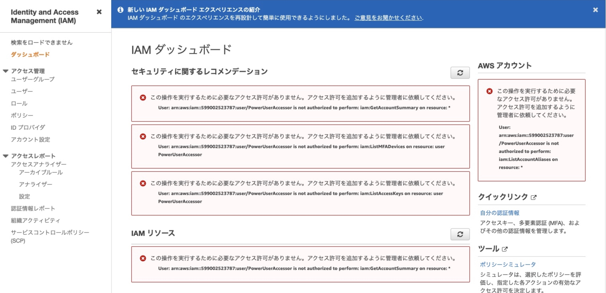

## 課題１
### IAMユーザー
AWSマネジメントコンソールやAPIを通じて、AWSの操作に使用する。各IAMユーザーに対して、操作を許可する（しない）AWSのサービスを定義する。

### IAMグループ
同一の役割を持つIAMユーザーをグループ化する機能。
IAMユーザー同様にAWSサービスのアクセス権限を付与することができ、グループに権限を付与してIAMユーザーを参加させることにより、役割別グループを作成できる。
IAMユーザーは複数のグループに所属することができる。

### IAMポリシー
AWSリソースへの操作を許可する（しない）をJSON形式でまとめたもの。
どのサービスの・どの機能や範囲を・許可または拒否、という3つの大きなルールに基づいて、AWSサービスを利用する上での様々な権限を設定する。

### IAMロール
AWSサービスやアプリケーションに対して、AWSの操作権限を与える仕組み。

例として、EC2に対してIAMロールを割り当てることにより、EC2上で実行するアプリケーションはアクセスキーID・シークレットアクセスキーを設定することなく、そのEC2に割り当て得られたAWSの操作権限を利用することができる。

## 課題2
### IAMユーザー
#### ルートユーザーではなく、管理者権限のIAMユーザーでログインした方が良い理由
ルートユーザーはAWSの全サービスに対して無制限のアクセスが可能であり、このアクセス権限を制限することはできない。
そのため、誤った操作や第三者により乗っ取られた場合のリスクが大きい。

#### PowerUserAccessポリシーを付与したIAMユーザー
PowerUserAccessポリシーの内容は以下の通り。
IAMのリソース操作は、`CreateServiceLinkedRole`, `DeleteServiceLinkedRole`, `ListRoles`のみが許可されている。
```json
{
    "Version": "2012-10-17",
    "Statement": [
        {
            "Effect": "Allow",
            "NotAction": [
                "iam:*",
                "organizations:*",
                "account:*"
            ],
            "Resource": "*"
        },
        {
            "Effect": "Allow",
            "Action": [
                "iam:CreateServiceLinkedRole",
                "iam:DeleteServiceLinkedRole",
                "iam:ListRoles",
                "organizations:DescribeOrganization",
                "account:ListRegions"
            ],
            "Resource": "*"
        }
    ]
}
```

IAMダッシュボードでは、IAMの`GetAccountSummary`, `ListMFADevices`, `ListAccessKeys`, `GetAccountSummary`, `ListAccountAliases`が行われようとしているが、PowerUserAccessポリシーでは許可されていないため、以下キャプチャのようなエラーとなる。


### IAMグループ
#### AdministratorAccessポリシーを直接ユーザーに付与する方法と、グループに付与してユーザーを所属させる方法は、どちらの方が適切か？
グループに付与してユーザーを所属させた方が、Administrator権限を持つユーザーの一覧性が良く、メンテナンスもしやすいと感じる。
また、一度に複数ユーザーにポリシーを付与したい場合、直接ユーザーに付与すると人数分同様の操作が必要になるが、グループに付与すると操作は1度で済む。

### サービスのIAM
#### 特定のS3バケットに対して、バケットに保存されているオブジェクト一覧表示を許可する
- `sample_backet`というS3バケットに対して、許可するポリシー
```json
{
    "Version": "2012-10-17",
    "Statement": [
        {
            "Effect": "Allow",
            "Action": [
                "s3:ListBucket"
            ],
            "Resource": [
                "arn:aws:s3:::sample_backet"
            ]
        }
    ]
}
```

- EC2インスタンスに、上記ポリシーがアタッチされたロールを割り当てる
```shell
# ロール割り当て前は、オブジェクト一覧表示ができない
[ec2-user@ip-172-31-14-180 ~]$ aws s3 ls s3://sample_backet
Unable to locate credentials. You can configure credentials by running "aws configure".

# ロール割り当て後は、オブジェクト一覧表示ができる
[ec2-user@ip-172-31-14-180 ~]$ aws s3 ls s3://sample_backet
2022-03-03 12:32:30          0 sample.txt

# ロール割り当て後、another_backetという未許可のバケットに対してはオブジェクト一覧表示ができない
[ec2-user@ip-172-31-14-180 ~]$ aws s3 ls s3://another_backet
An error occurred (AccessDenied) when calling the ListObjectsV2 operation: Access Denied
```

#### EC2インスタンスにロールを付与するべきか直接ポリシーを付与するべきか、どちらの方が適切か？
直接ポリシーを付与した場合、EC2インスタンスを削除すると付与したポリシーの情報がわからなくなってしまうため、再利用性がない。そのためロールを付与したようが良いと感じる。

## 課題3（クイズ）
1つのIAMユーザーを複数人で共有するのは推奨されない行為とされている。その理由は？
<details><summary>回答</summary><div>
誰が行った操作であるのかが、追跡できなくなるため。
</div></details>
