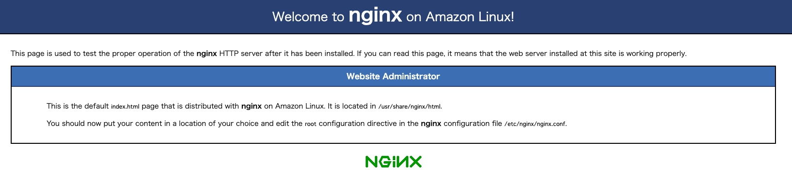
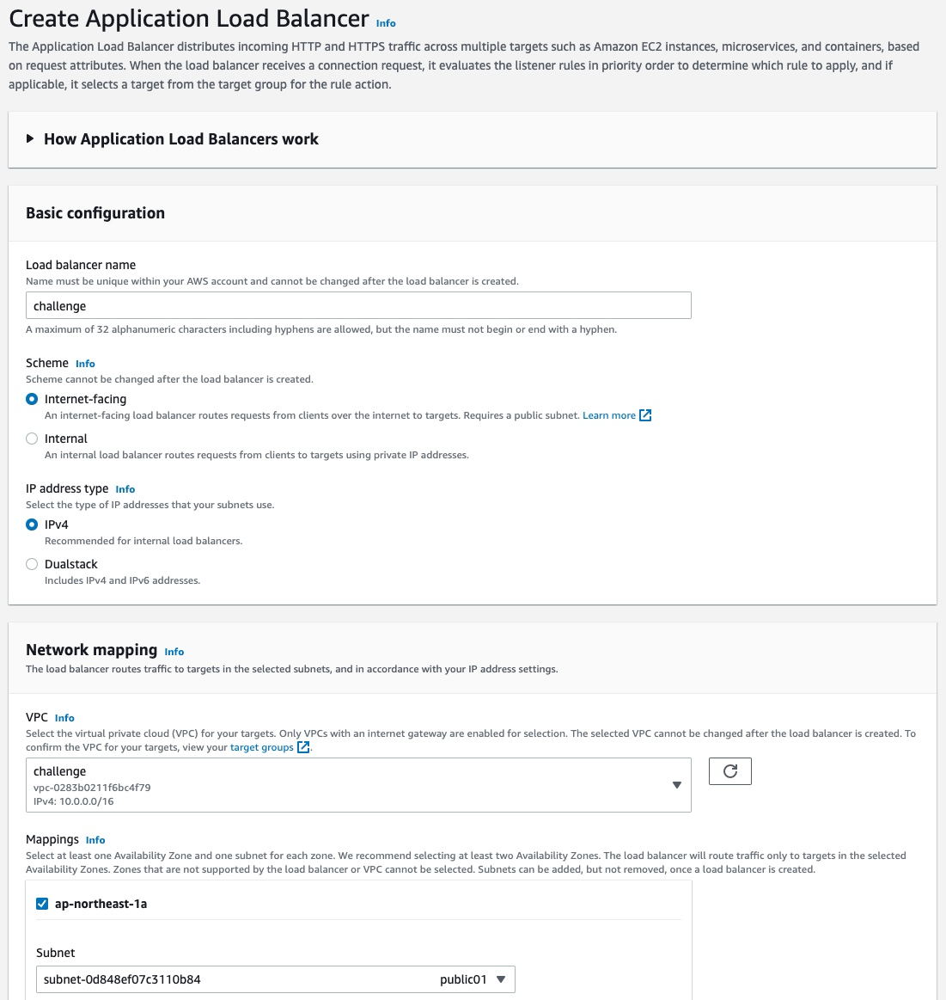
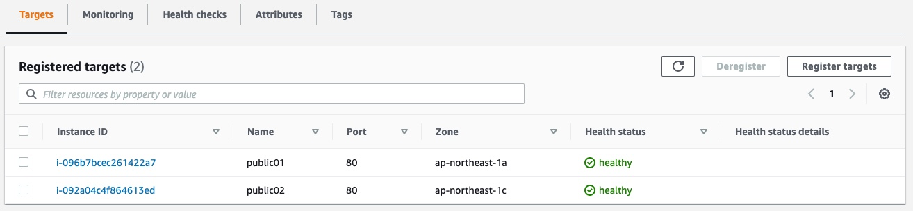
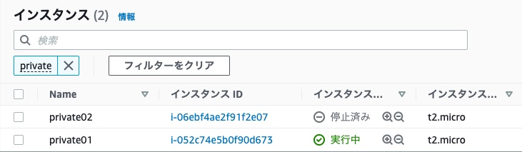

## 課題１
### Nginxの導入・起動
作成したEC2インスタンスで、以下のコマンドを実行する。
```shell
sudo amazon-linux-extras install nginx1

nginx -v
nginx version: nginx/1.20.0

# Nginxを起動、起動していることを確認
sudo systemctl start nginx
sudo systemctl status nginx
```

### セキュリティグループの作成
HTTP通信を許可するために、80ポートを開放するセキュリティグループを作成し、EC2インスタンスに追加する。

### Nginxがhtmlを返すことを確認
ブラウザでEC2インスタンスにアクセスすると、Nginxのデフォルトのページが表示される。


### 内容が異なるhtmlページの作成
上記手順を繰り返し、Nginxのデフォルトのページが表示されるEC2インスタンスを用意する。
片方のEC2インスタンスで`hello from AZ 1`, もう片方のEC2インスタンスで`hello from AZ 2`が表示されるように、htmlファイルを書き換える。
```shell
sudo vim /usr/share/nginx/html/index.html
```
```diff
 <body>
-  <h1>Welcome to <strong>nginx</strong> on Amazon Linux!</h1>
+  <h1>hello from AZ 1</h1>
   ...
 </body>
```

```diff
 <body>
-  <h1>Welcome to <strong>nginx</strong> on Amazon Linux!</h1>
+  <h1>hello from AZ 2</h1>
   ...
 </body>
```

### ALBの作成
ALBを作成する。


ターゲットグループで、上記で作成したEC2インスタンスをそれぞれ登録する。


### ALBにアクセス
ブラウザから作成したALBのAレコードにアクセスすると、`hello from AZ 1`を表示するページと`hello from AZ 2`を表示するページが交互に表示される（ランダムではなかった）。

### 片方のEC2インスタンスを停止する。
`hello from AZ 2`を表示するEC2インスタンスを停止する。


その後ALBのAレコードにアクセスすると、`hello from AZ 1`のみが表示されることが確認できる。

## その他
ELBには、ALB、NLB、CLBの3種類がある。

### ALB（Application Load Balancer）
HTTPおよびHTTPSに最適なロードバランサーで、OSI参照モデルにおけるアプリケーション層で動作する。
対応プロトコル: HTTP, HTTPS 

### NLB（Network Load Balancer）
OSI参照モデルにおけるトランスポート層で動作する。
対応プロトコル: TCP, TLS

### CLB（Classic Load Balancer）
元々、AWSのロードバランシングサービスはELBだけだった。その後ALBが追加されたことで、従来のELBはCLBに名称変更された。
従来のELBを使ったシステムの後方互換性のために残されているもので、新たに採用される機会はほとんどない。
対応プロトコル: TCP, SSL/TLS, HTTP, HTTPS
