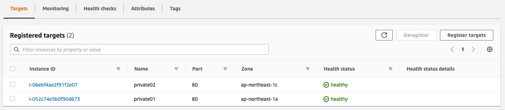

## 課題１

### NAT ゲートウェイ

プライベートサブネットの EC2 インスタンスに Nginx をインストールするために、NAT ゲートウェイを作成する。
（サブネットはパブリックサブネットを選択する）


### Nginx の導入・起動

プライペートサブネットの EC2 インスタンスで、以下のコマンドを実行する。

```shell
sudo amazon-linux-extras install nginx1

nginx -v
nginx version: nginx/1.20.0

# Nginxを起動、起動していることを確認
sudo systemctl start nginx
sudo systemctl status nginx
```

### セキュリティグループの作成

HTTP 通信を許可するために、80 ポートを開放するセキュリティグループを作成し、プライベートサブネットの EC2 インスタンスに追加する。

### Nginx が html を返すことを確認

ブラウザで EC2 インスタンスにアクセスすると、Nginx のデフォルトのページが表示される。


### 内容が異なる html ページの作成

上記手順を繰り返し、Nginx のデフォルトのページが表示される EC2 インスタンスを用意する。
片方の EC2 インスタンスで`hello from AZ 1`, もう片方の EC2 インスタンスで`hello from AZ 2`が表示されるように、html ファイルを書き換える。

```shell
sudo vim /usr/share/nginx/html/index.html
```

```diff
 <body>
-  <h1>Welcome to <strong>nginx</strong> on Amazon Linux!</h1>
+  <h1>hello from AZ 1</h1>
   ...
 </body>
```

```diff
 <body>
-  <h1>Welcome to <strong>nginx</strong> on Amazon Linux!</h1>
+  <h1>hello from AZ 2</h1>
   ...
 </body>
```

### ALB の作成

ALB を作成する。


ターゲットグループで、プラペートサブネットの EC2 インスタンスをそれぞれ登録する。


### ALB にアクセス

ブラウザから作成した ALB の A レコードにアクセスすると、`hello from AZ 1`を表示するページと`hello from AZ 2`を表示するページが交互に表示される（ランダムではなかった）。

### 片方の EC2 インスタンスを停止する。

`hello from AZ 2`を表示する EC2 インスタンスを停止する。


その後 ALB の A レコードにアクセスすると、`hello from AZ 1`のみが表示されることが確認できる。

## その他

ELB には、ALB、NLB、CLB の 3 種類がある。

### ALB（Application Load Balancer）

HTTP および HTTPS に最適なロードバランサーで、OSI 参照モデルにおけるアプリケーション層で動作する。
対応プロトコル: HTTP, HTTPS

### NLB（Network Load Balancer）

OSI 参照モデルにおけるトランスポート層で動作する。
対応プロトコル: TCP, TLS

### CLB（Classic Load Balancer）

元々、AWS のロードバランシングサービスは ELB だけだった。その後 ALB が追加されたことで、従来の ELB は CLB に名称変更された。
従来の ELB を使ったシステムの後方互換性のために残されているもので、新たに採用される機会はほとんどない。
対応プロトコル: TCP, SSL/TLS, HTTP, HTTPS
