## 課題 1

### ストレージクラス

#### ストレージクラスの選び方

オブジェクトのアクセス頻度や復元力、コスト要件に基づいて選択する。

[Amazon S3 ストレージクラス](https://aws.amazon.com/jp/s3/storage-classes/)

#### ほとんどアクセスされないバケットに適したストレージクラス

Glacier ストレージクラスがコストが抑えられるため、適している。

[Amazon S3 Glacier ストレージクラス](https://aws.amazon.com/jp/s3/storage-classes/glacier/)

### ライフサイクル

#### ライフサイクルとは

オブジェクトを定期的に別のストレージクラスに移行したり、削除するためのルール。

#### 定期的な別のストレージクラスへの移行

- バケットの`ids/`フォルダに画像オブジェクトをアップロードする。
  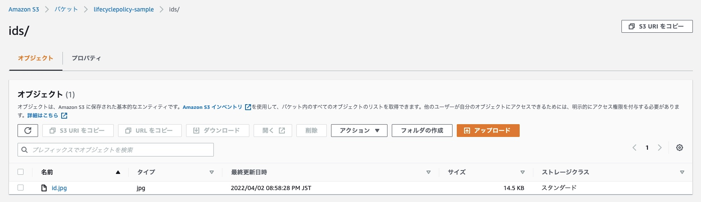

- `ids/`フォルダ配下のオブジェクトが、作成後 30 日経過すると Glacier Instant Retrieval に移行するライフサイクルルールを作成する。
  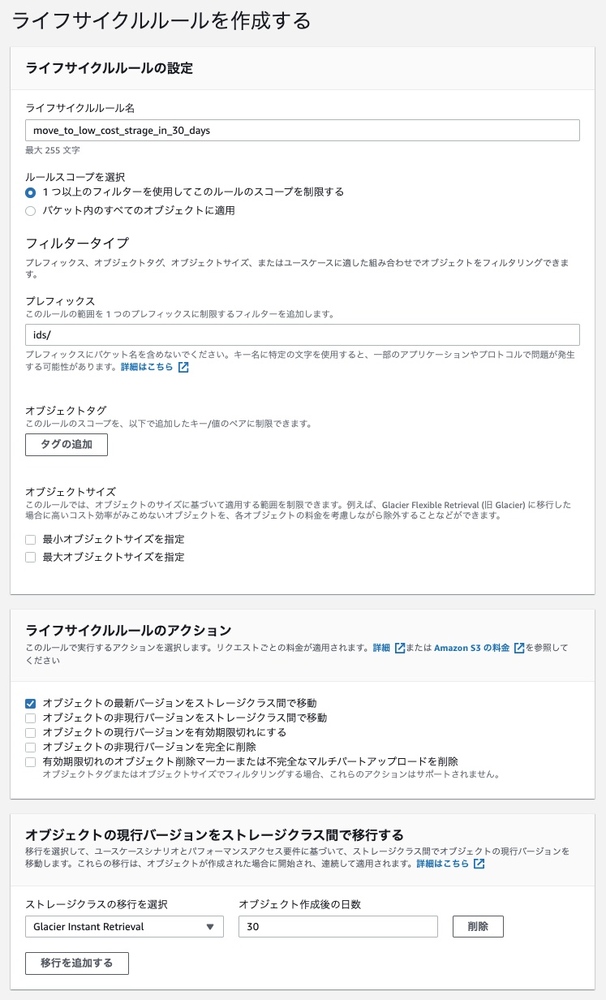

#### 定期的な削除

- バケットの`logs/`フォルダにテキストオブジェクトをアップロードする。
  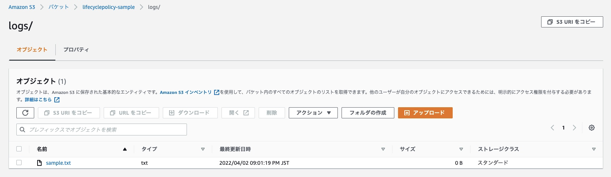

- `logs/`フォルダ配下のオブジェクトが、作成後 90 日経過すると有効期限切れにするライフサイクルルールを作成する。存続期間が終了したオブジェクトは自動的に削除キューに追加され、非同期的に削除される。
  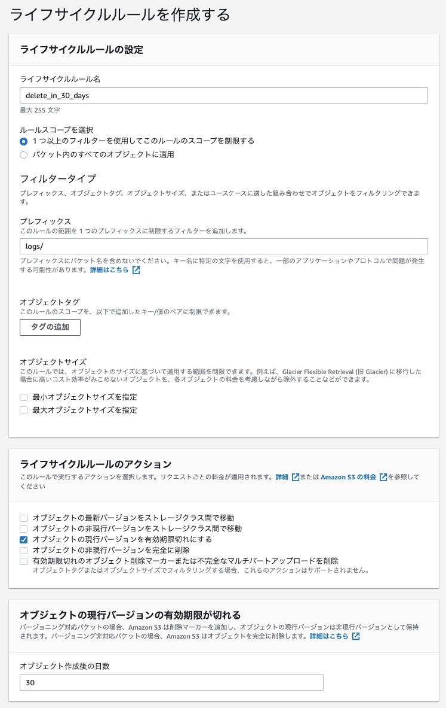

## 課題 2

### バージョニング

オブジェクトの複数バージョンを保存する機能のことで、バケット単位で設定する。

バージョニングを有効にすることで、オブジェクトを誤って更新・削除したとしても復元することができる。

### レプリケーション

レプリカ（複製）を作る機能のこと。

クロスリージョンレプリケーションは、異なるリージョンに作成したバケットに、オブジェクトを非同期でコピーする。~~なお、同一リージョンのバケット同士の場合は、レプリケーションは設定できない。~~
[Amazon S3 にセイムリージョンレプリケーションが導入されます(2019/9/18)](https://aws.amazon.com/jp/about-aws/whats-new/2019/09/amazon-s3-introduces-same-region-replication/)

コピー先のバケットは、コピー元のバケットの持ち主と同じである必要はないが、レプリケート作業を行う IAM ロールは必要である。

使用する双方のバケットは、バージョニングが有効になっている必要がある。

クロスリージョンレプリケーションを使えば、海外にもバックアップを撮ることができるため、日本において大規模な災害が起きたときにも、データを失うことはない。

一方で、海外にデータを置くことになるので、国外に持ち出してはいけないデータを適用しないように気をつけるべきである。

### バージョニングの設定

- バケット作成時、`バケットのバージョニング`を有効にする。
  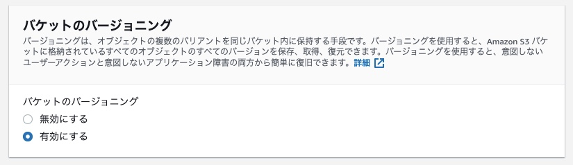

- アップロードしたオブジェクトを削除する。
  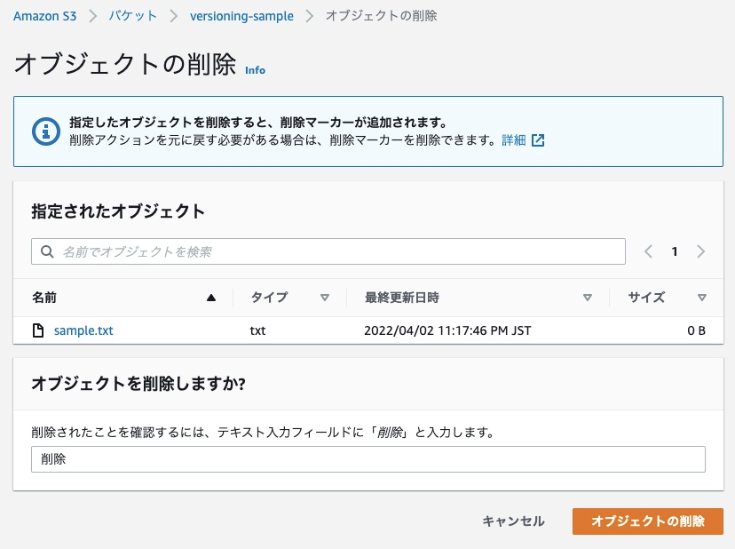

- 削除マーカーがオブジェクトの最新バージョンになり、実際のオブジェクトが以前のバージョンになる。削除マーカーを削除することで、元のオブジェクトを復元することができる。
  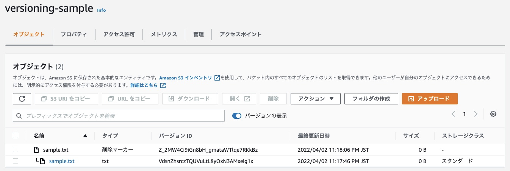

### クロスリージョンレプリケーションの設定

- 異なる 2 つのリージョンにバージョニングを有効にしたバケットを作成する。
  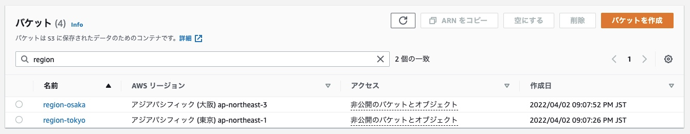

- 片方（ap-northeast-1）のバケットにレプリケーションルールを作成する。送信先には、もう片方（ap-northeast-3）のバケットを設定する。
  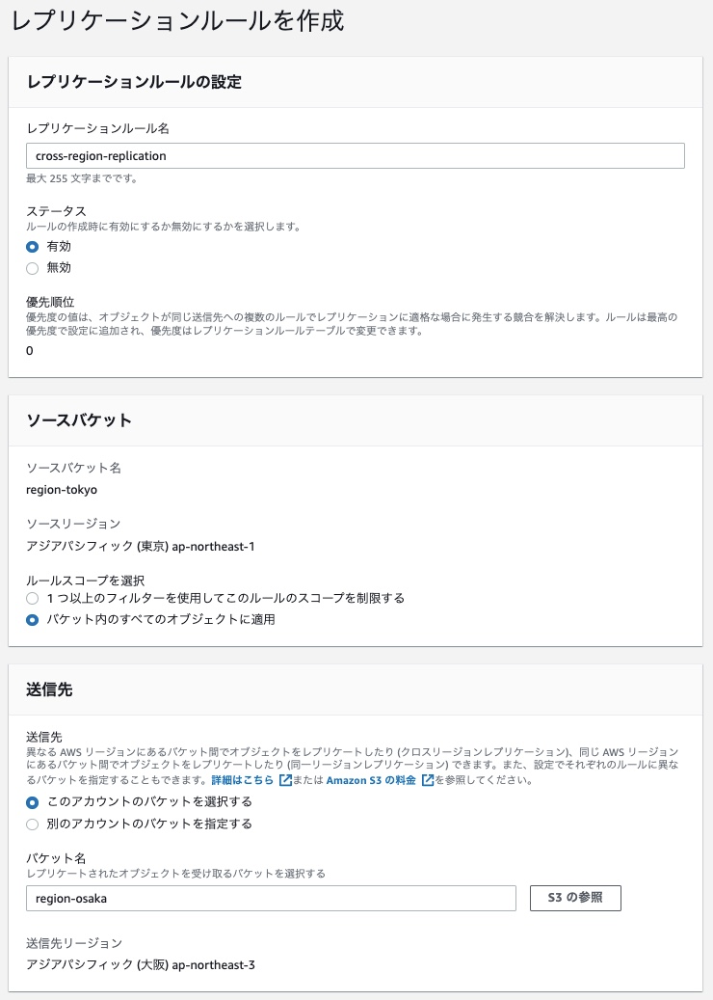

- レプリケーションルールを設定したバケットにオブジェクトをアップロードする。
  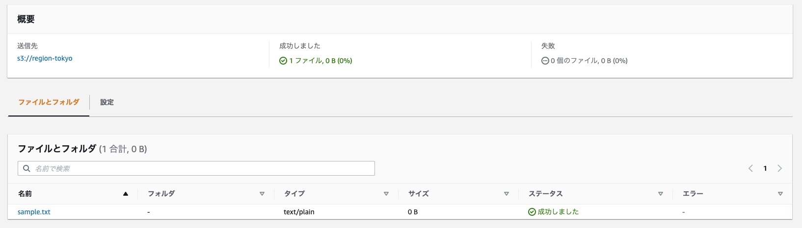

- レプリケーションにより、送信先のバケットにオブジェクトがコピーされる。
  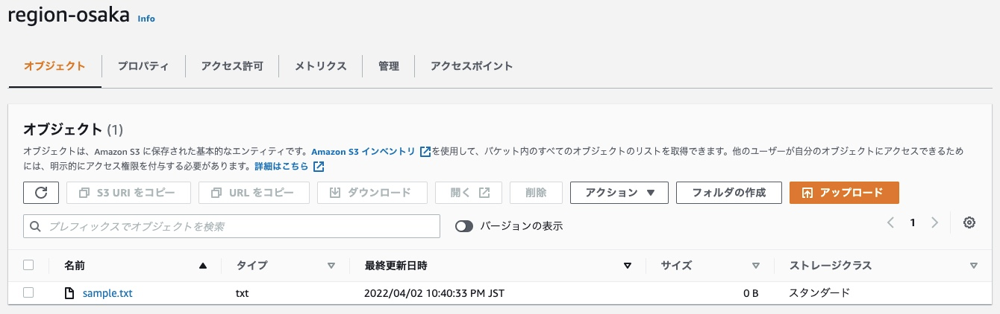
