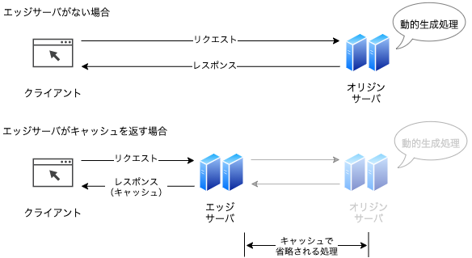
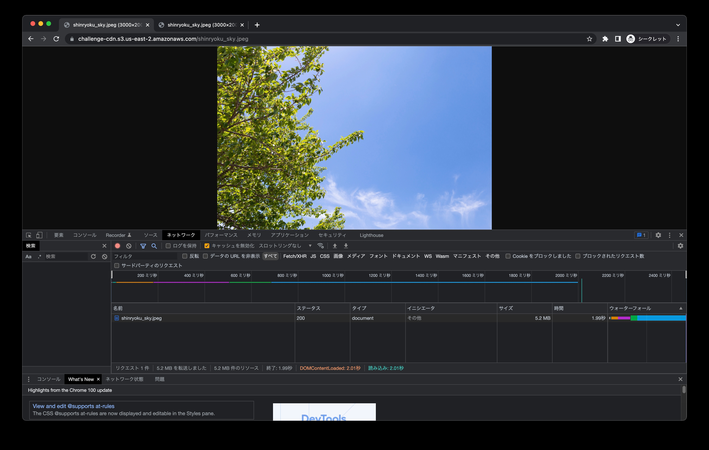
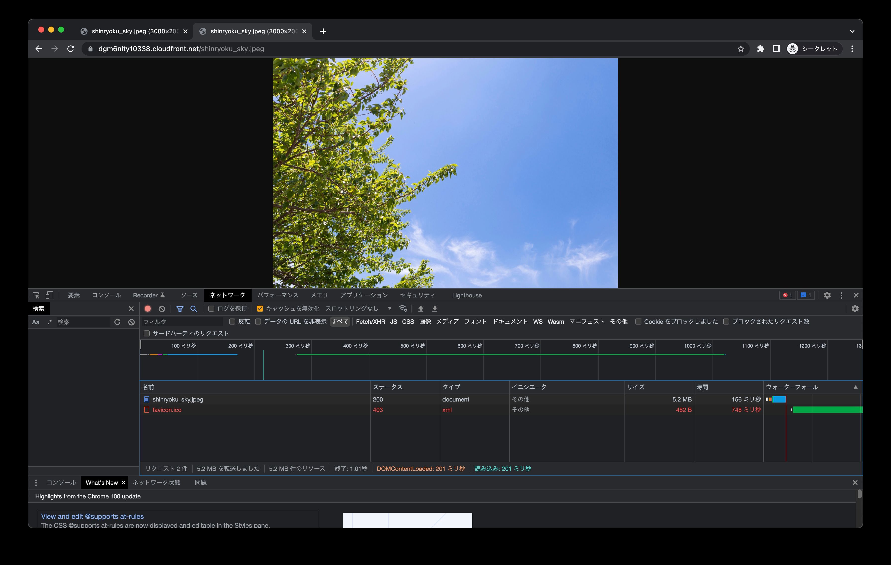

## 課題 1

### CDN によるパフォーマンス改善

#### キャッシュによるレスポンスの高速化

Web アプリケーションの多くは、リクエストのたびにレスポンスを動的に生成する。動的生成時は、DB へのアクセス、HTML や JSON の文字列を生成する処理などがあり、レスポンスのたびに数百ミリ秒を要することも珍しくない。

エッジサーバ上のキャッシュが有効であれば、数百ミリ秒に及ぶ処理時間をまるまる短縮できるため、レスポンスの顕著な高速化を期待できる。

#### 伝送距離の短縮による遅延低減

分散ネットワーク上でクライアントと物理的に近いエッジサーバから配信することは、データ伝送距離の短縮につながる。

伝送距離が短ければラウンドトリップタイム（リクエストを送信してから応答が返ってくるまでに発生する遅延時間）も短くなる。日本からアメリカ西海岸のサーバにアクセスするときデータが往復するだけで 200 ～ 300 ミリ秒程度の遅延が発生するところが、日本国内に PoP（Point of Presence）があればデータが往復するときの遅延を 100 ミリ秒未満に抑えられる。

クライアントとオリジンサーバ間の地理的な条件による不利を緩和できるので、グローバルなサービスを展開するビジネスでは重要なポイントとなる。

#### アクセス集中時や大量配信の安定化

アクセス集中時に CDN のエッジサーバからキャッシュされたコンテンツをクライアントに配信するようになっていれば、オリジンサーバは過負荷から保護される。急激なアクセスの集中が起こり得る状況での安定した配信にも、CDN は役立つ。

### オリジンサーバとエッジサーバの違い

#### オリジンサーバ

CDN が組み込まれたシステムにおいて、自分たちで管理していてコンテンツを大もとで配信するサーバ

#### エッジサーバ

CDN の分散ネットワーク上にあって、クライアントからのリクエストを受けてコンテンツを代理配信するサーバ

#### クライアント、オリジンサーバ、エッジサーバの関係

例えば URL が`https://www.example.com/`である Web ページに CDN を適用するときは、`www.example.com`の CNAME（ドメインの参照先に別のドメインを指定する DNS レコード）として CDN から提供されるホストを指定する。
加えて CDN の設定でオリジンサーバの情報を入力すると、CDN のエッジサーバがオリジンサーバへのリバースプロキシとして振る舞う。一般的にプロキシはクライアントとサーバの間に入って通信を経由させる役割を指すが、リバースプロキシは特定のサーバへのリクエスト時に必ず経由するように置かれるプロキシである。
CDN は独立したリバースプロキシとして動作するため、オリジンサーバの動作環境（オンプレミス、クラウドなど）を問わず利用できる。

### ブラウザキャッシュと比較したときの CDN の利点

HTTP キャッシュは大きく分けて、ローカルキャッシュとシェアードキャッシュがある。

#### ローカルキャッシュ（主にブラウザ）

- ブラウザが実行されている端末内に保持されるキャッシュ。
- 一度リクエストをしてレスポンスを受け取ったあとに 2 回目以降で有効になるため、初回リクエストでは効果がない。
- ローカルに保持されるため、1 つの端末でユーザプロファイルを使い回して共用している場合など、ユーザが 1 人に限定されないこともある。そのため、ログイン中に生成されるプライベートな情報が含まれる HTML を無闇にキャッシュさせるべきではない。

#### シェアードキャッシュ（プロキシサーバなど）

- 複数のクライアントに対する応答として共用される。
- 1 人目の誰かがリクエストしたあと 2 人目以降の全員に有効。
- 共用のキャッシュなので、プライベートな情報は一切保持してはならない。

ブラウザキャッシュを使えば、サイトの巡回中や再訪時に、自身の端末に保存されたキャッシュが使える。このため、インターネット越しにコンテンツをダウンロードする必要がなく、より速く、快適になる。

しかし、前述したようにブラウザキャッシュは 2 回目以降で有効になる。EC サイトのタイムセールや TV 番組で紹介されたサイトなど、突発的なアクセス増加ではキャッシュが有効に使えず、最悪サーバがダウンすることもある。
そこで、サーバの負荷を減らすために複数のクライアントで共有するキャッシュとして CDN の利用が有効となる。

[参考: HTTP キャッシュ入門の入門](http://blog.xcir.net/?p=2806)

## 課題 2

### S3 バケットの作成と画像のアップロード

米国東部 (オハイオ) us-east-2 のリージョンに S3 バケットを作成し、画像をアップロードする。
バケットポリシーには以下の設定をする。
[匿名ユーザーへの読み取り専用アクセス許可の付与](https://docs.aws.amazon.com/ja_jp/AmazonS3/latest/userguide/example-bucket-policies.html#example-bucket-policies-use-case-2)

### CloudFront でディストリビューションの作成

オリジンドメインには、作成した S3 バケットのドメインを設定する。

### 画像を取得するための所要時間の比較

5.2MB の画像の取得では、直接 S3 のオブジェクトにアクセスした場合の `1.99 秒`に対して、CloudFront 経由では `156 ミリ秒`と高速になっていることが確認できた。

#### 直接 S3 のオブジェクトにアクセスした場合

ブラウザから、S3 のオブジェクト URL にアクセスする。

#### CloudFront 経由で S3 のオブジェクトにアクセスした場合

ブラウザから、CloudFront 経由（S3 のオブジェクト URL のうち、ドメインをディストリビューションドメイン名に置き換える）でアクセスする。

