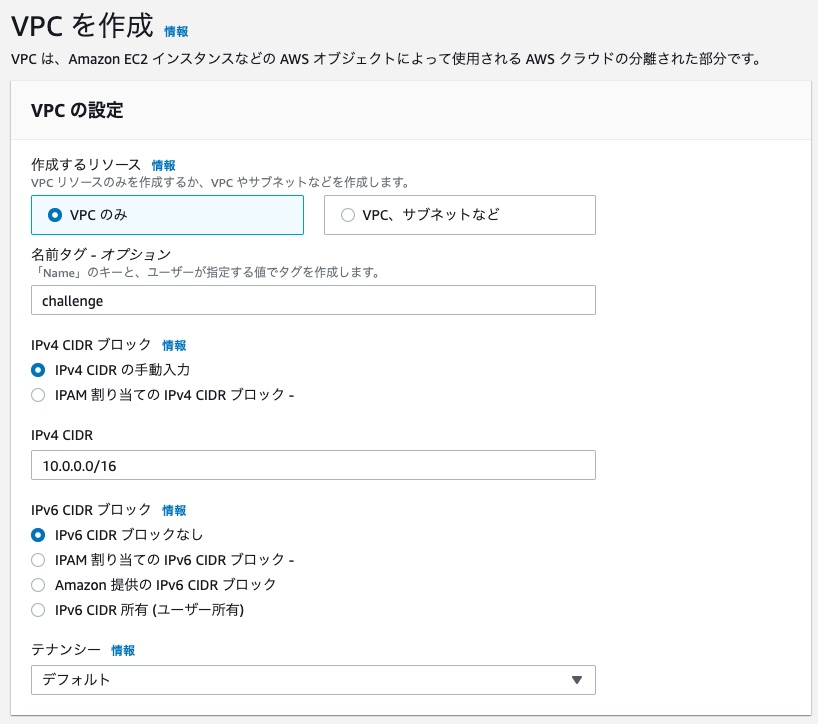
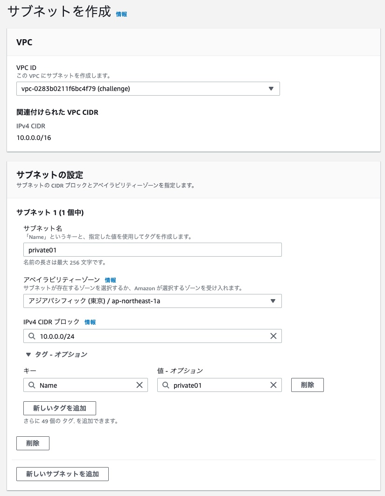
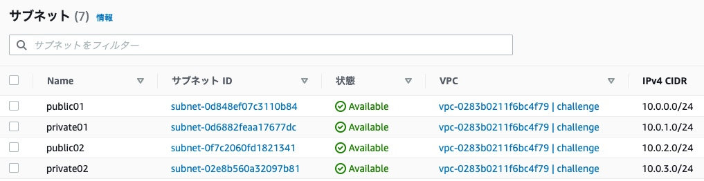
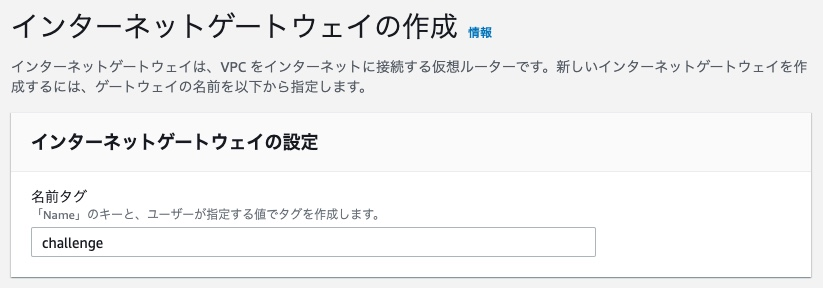
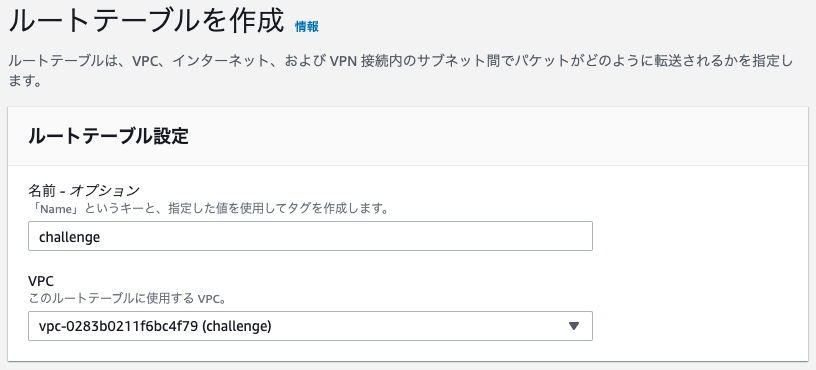
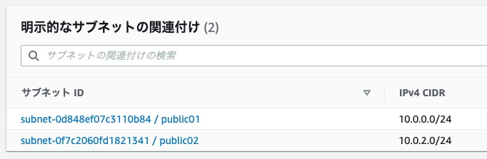
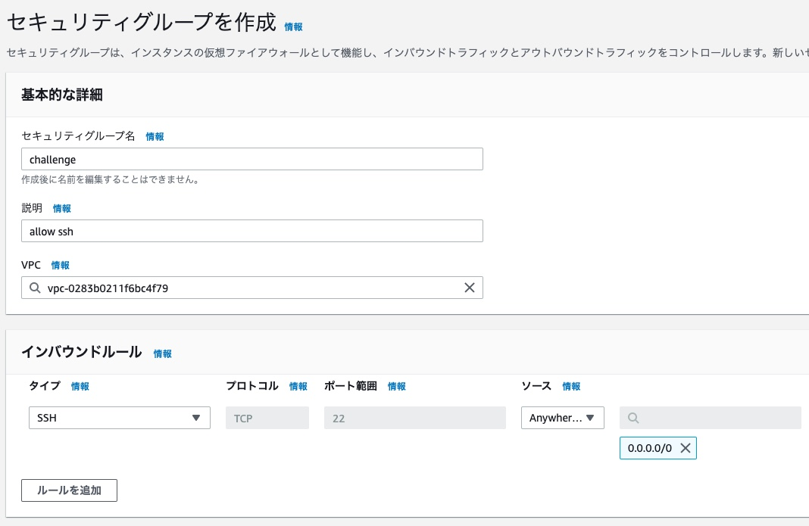

## 課題１
### プライベートサブネットとパブリックサブネット
違いはインターネットから接続できるかどうか、である。
- プライベートサブネット
  - インターネットから接続不可

- パブリックサブネット
  - インターネットゲートウェイを通して、インターネットから接続可能

### VPCにプライベートサブネットとパブリックサブネットをマルチAZで構築
- VPCの作成


- プライベートサブネットとパブリックサブネットの作成
  - 一例として、プライベートサブネットの作成画面を掲載する。
    - VPC IDは、上記で作成したVPCを選択する。
    - AZは`ap-northeast-1a`とする。

  

  - 同じ要領で、他のサブネットも作成する。
    - キャプチャにはないが、AZは以下のように設定している。
      - private01: `ap-northeast-1a`
      - public01: `ap-northeast-1a`
      - private02: `ap-northeast-1c`
      - public02: `ap-northeast-1c`

  

  ### パブリックサブネットにSSH可能なEC2インスタンスを作成してアクセス
  - インターネットゲートウェイの作成
    - ローカルマシンからSSHするために、インターネットゲートウェイを作成する。

  

  - 作成したインターネットゲートウェイをVPCにアタッチする。

  - ルートテーブルの作成
    - VPCを指定して、ルートテーブルを作成する。

  

  - 作成したルートテーブルで、パブリックサブネットを関連付ける。

  

  - セキュリティグループの作成
    - SSHアクセスを許可するセキュリティグループを作成する。
      - インバウンドルールで22ポートの開放と、どのIPv4アドレスからでもアクセスできるように設定する。
  

  - EC2インスタンスの作成
    - 異なるAZのパブリックサブネットに、1つずつEC2インスタンスを作成する。

  - SSHアクセス
  ```shell
    # ap-northeast-1aのEC2インスタンスにSSHアクセス
    $ ssh -i "public01.pem" ec2-user@パブリックサブネットのEC2インスタンスのパブリックIPアドレス

    # ap-northeast-1cのEC2インスタンスにSSHアクセス
    $ ssh -i "public02.pem" ec2-user@パブリックサブネットのEC2インスタンスのパブリックIPアドレス
  ```

  ### プライベートサブネットにEC2インスタンスを作成してSSHアクセス
  プライベートサブネットにもEC2インスタンスを作成し、パブリックサブネットのEC2インスタンスからのみプライベートサブネットのEC２インスタンスにSSHでアクセスできるようにする。

  - EC2インスタンスの作成
    - 異なるAZのプライベートサブネットに、1つずつEC2インスタンスを作成する。

  - プライベートサブネットに作成したEC2インスタンスの秘密鍵を、パブリックサブネットに作成したEC2インスタンスに配置する。
  ```shell
  $ sftp -i "public01.pem" ec2-user@パブリックサブネットのEC2インスタンスのパブリックIPアドレス
  Connected to パブリックサブネットのEC2インスタンスのパブリックIPアドレス
  sftp> put private01.pem
  Uploading private01.pem to /home/ec2-user/private01.pem

  $ ssh -i "public01.pem" ec2-user@パブリックサブネットのEC2インスタンスのパブリックIPアドレス
  sudo mkdir /.ssh
  sudo mv private01.pem /.ssh
  cd /.ssh
  sudo chmod 400 private01.pem
  ```

  - パブリックサブネットのEC2インスタンスからのみプライベートサブネットのEC２インスタンスにSSHでアクセスする。
  ```shell
  # 上記の秘密鍵配置に続けて、パブリックサブネットのEC2インスタンスで実行
  ssh -i "private01.pem" ec2-user@プライベートサブネットのEC2インスタンスのプライベートIPアドレス
  ```

（もう一つのAZのECインスタンスも同様）

### プライベートサブネットのEC2インスタンスに、VPCの外からアクセスできないことを確認
```shell
# ローカルマシンで実行
$ ssh -i "private01.pem" ec2-user@プライベートサブネットのEC2インスタンスのパブリックIPアドレス
ssh: connect to host ec2-user@プライベートサブネットのEC2インスタンスのパブリックIPアドレス port 22: Operation timed out

$ ssh -i "private01.pem" ec2-user@プライベートサブネットのEC2インスタンスのプライベートIPアドレス
ssh: connect to host ec2-user@プライベートサブネットのEC2インスタンスのプライベートIPアドレス port 22: Operation timed out
```

（もう一つのAZのECインスタンスも同様）
