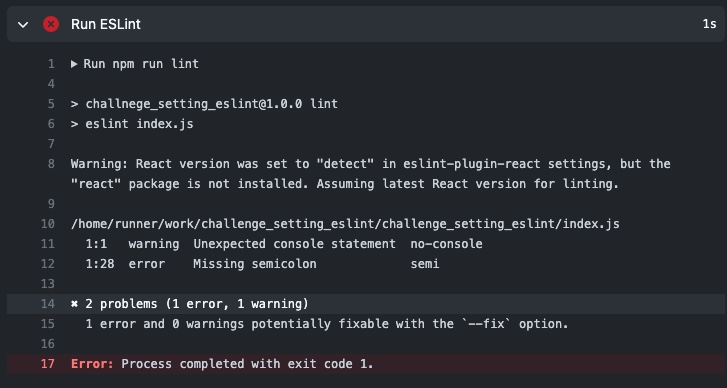

## 課題 1

### PR 作成時に ESLint を実行する

on シンタックスで、pull_request イベントの`opened`を指定する。
詳細は[こちらの PR](https://github.com/k-kbot/challenge_setting_eslint/pull/3/files)を参照

ワークフローの実行結果は以下の通り。


[参考: GitHub Docs - Events that trigger workflows](https://docs.github.com/en/actions/using-workflows/events-that-trigger-workflows)

## 課題 3

### ビルド時間を短縮するためにできること

ワークフロー内で頻繁に使われる依存データをキャッシュする仕組みを GitHub Actions は標準でサポートしている。

キャッシュは、リポジトリのすべてのワークフローで共有可能で、例えば main ブランチでダウンロードされたパッケージをキャッシュし、他のブランチでリストアして利用することができる。ワークフロー内で、依存データをキャッシュする際には、キャッシュアクション[actions/cache](https://github.com/actions/cache)を用いる。

[参考: GitHub Docs - Caching dependencies to speed up workflows](https://docs.github.com/en/actions/using-workflows/caching-dependencies-to-speed-up-workflows)

### GitHub の外部で生じるアクティビティのためにワークフローをトリガーする

GitHub Actions は、リポジトリを直接操作しなくても、外部からワークフローを実行するためのエンドポイントを用意している。

そのエンドポイントにリクエストを投げると、`repository_dispatch` というイベントが発生する。

[参考: GitHub Docs - Create a repository dispatch event](https://docs.github.com/ja/rest/repos/repos#create-a-repository-dispatch-event)

### 特定のディレクトリ配下が変更された時のみワークフローを実行

`paths`フィルタでパスを指定し、そのパターンにマッチするとワークフローが実行される。

```yaml
on:
  push:
    paths:
      - "docs/**"
```

なお、`braches`フィルタではブランチの指定ができる。

```yaml
on:
  push:
    branches:
      - main
      - "releases/**"
```

[参考: GitHub Docs - Workflow syntax for GitHub Actions](https://docs.github.com/en/enterprise-server@3.2/actions/using-workflows/workflow-syntax-for-github-actions)

### 直列に job を実行する

`jobs.<job_id>.needs`シンタックスを使うことで、他の job に対する依存関係を定義できる
以下のように記述した場合、job_a, job_b, job_c の順番に実行される。
なお、`jobs.<job_id>.needs`を指定しない場合（デフォルト）では、各 job は並列で実行される。

```yaml
jobs:
  job_a:
    runs-on: ubuntu-latest
    steps:
      # 略
  job_b:
    needs: job_a # 直列実行の定義
    runs-on: ubuntu-latest
    steps:
      # 略
  job_c:
    needs: job_b # 直列実行の定義
    runs-on: ubuntu-latest
    steps:
      # 略
```

また、直列実行と並列実行を組み合わせることもできる。
以下のように記述すると、job_a が完了したら job_b, job_c, job_d を実行、job_b, job_c, job_d が全て完了したら job_e を実行することができる。

```yaml
jobs:
  job_a:
    runs-on: ubuntu-latest
    steps:
      # 略
  job_b:
    needs:
      job_a
      # 略
  job_c:
    needs:
      job_a
      # 略
  job_d:
    needs:
      job_a
      # 略
  job_e:
    needs:
      [job_b, job_c, job_d]
      # 略
```

### ワークフローからシークレット変数にアクセスする

GitHub Actions では、トークンやパスワードなどのシークレット情報を安全かつ簡単に扱える仕組みを提供している。

シークレットはリポジトリの[Settings]タブ → [Secrets]から設定できる。

設定したシークレット変数は、ワークフローから`${{ secrets.シークレット変数名 }}`としてアクセスできる。

```yaml
steps:
  - name: Hello world action
    with: # Set the secret as an input
      super_secret: ${{ secrets.SuperSecret }}
    env: # Or as an environment variable
      super_secret: ${{ secrets.SuperSecret }}
```

[参考: GitHub Docs - Using encrypted secrets in a workflow](https://docs.github.com/en/actions/security-guides/encrypted-secrets#using-encrypted-secrets-in-a-workflow)
