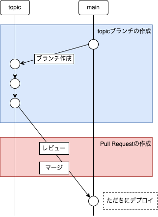
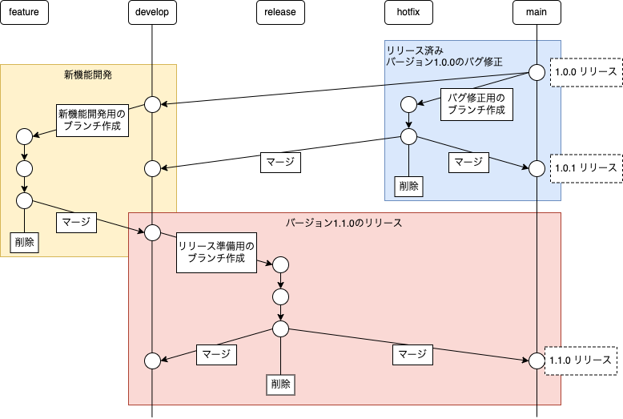

## 課題 1

### GitHub flow

機能開発、バグ修正などすべての作業は main ブランチから topic ブランチを作成することから始まる。このときのブランチ名は何のためのブランチなのかがわかるよう、add-user-signup や fix-user-signup-bug などの説明的な名前にする。このブランチは定期的にリモートにプッシュする。

- main
  - 常にデプロイ可能なブランチ
- topic
  - 新機能の追加・バグ修正などを行うブランチ

GitHub Flow は GitHub などのホスティングサービスを使うことを前提としており、Pull Request の作成もフローの一部となっている。

レビュアーによってコードに問題がないことが確認されたら、topic ブランチを main ブランチにマージする。マージされたらただちに稼働環境にデプロイする。

[参考: GitHub Docs - GitHub flow](https://docs.github.com/en/get-started/quickstart/github-flow)

#### メリット/デメリット

GitHub Flow のブランチ構成は非常にシンプルで、新機能・バグ修正を日々デプロイしていく必要がある Web サービスに向いている。
一方で、リリースにある程度の期間の審査を要する iOS, Andoroid アプリ開発には不向きである。

### git-flow

git-flow は「リリース間隔が長いメジャーリリース」と「緊急でリリースしたいマイナーリリース」が混在するようなパッケージ製品で有効なブランチ戦略である。
git-flow ではさまざまな用途のブランチが存在する。

- main
  - 製品としてリリースするためのブランチ
- hotfix
  - 製品に発生したバグを修正する場合に、その都度作成されるブランチ
- release
  - リリース作業を行う場合に、その都度作成されるブランチ
- develop
  - 次のリリースに向けて最新の開発を行うブランチ
- feature
  - 新機能開発を行う場合に、その都度作成されるブランチ

[参考: A successful Git branching model](https://nvie.com/posts/a-successful-git-branching-model/)

#### メリット/デメリット

git-flow は develop ブランチを中心として新バージョンを開発することで、現行バージョン（main ブランチ）に影響を与えないブランチ戦略になっている。
このため新バージョン開発中に現行バージョンにバグがあった場合でもすばやく修正を適用・リリースできるようになっており、比較的リリース間隔の長い、パッケージ製品のような開発に向いている。

しかし、プロジェクトによっては複雑すぎる場合がある。
